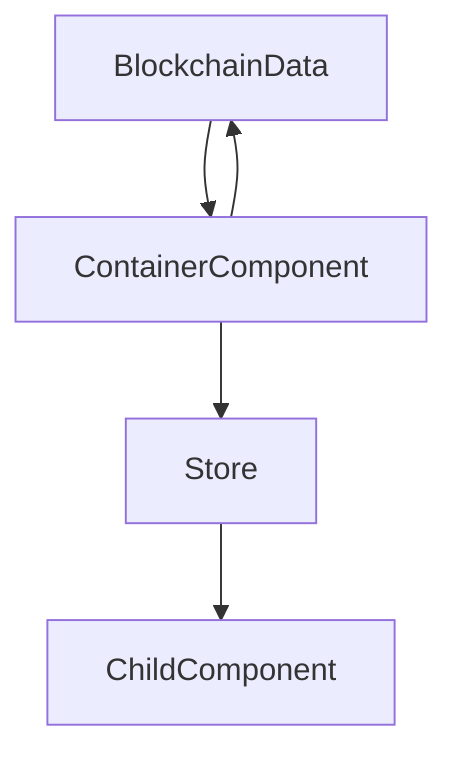

# Store

This doc described the following:

1. How the store is structured
2. How to use the store
3. Container components

## 1. How the store is structured

The store is the central 'database' of frontend. Information that is widely shared across components lives here. This has several benefits:

1. Performance increase (data is truly shared + only triggers rerenders when data changes)
2. Easier development
3. Easier maintenance
4. Less boilerplate code

The store is sliced up into different sections. This is mainly done for readability and ease of search. Each slice contains in general the following:

### 1.1 Variables

### 1.2. Functions:

#### a. General

These are functions that parse, combine or otherwise work with data from the store.

> **if the functions does not have any store dependencies (e.g. uses `get() or set()`) it should not be in the store**

#### b. Setters

These are used to set data to the store from the components.

> **Should always be called 'set...'**

#### c. Query related

All the query related methods / variables are here. It contains the following 4 categories:

- Previous data (contains the previous received data from the query. Used to skip unnecessary data processing)
- Process query
  1. Checks current vs. previous data
  2. Performs required calculations
  3. Sets variables
- Refetch query (Used to manually refetch queries from components)
- Set refetch query (Needs to be set from react-query in order to enable refetch)

> **Naming convention for e.g. BlockHeight query:** >`previousBlockHeightQueryData` >`processBlockHeightQuery` >`refetchBlockheightQuery` >`setRefetchBlockHeightQuery`

### 1.3. Files & folders

- `/interfaces`. The interface for each slice + a `store.interface.ts` that combines all the interfaces into one.
- `/slices`. Each of the slices.
- `index.ts`. Store is created here. Devtools are added when not in production mode.
- `store.ts`. All separate slices are spread into the rootslice. This main slice is used for store creation.

## 2. Using the store

For general documentation, see https://github.com/pmndrs/zustand

### 2.1. Adding store state

1. Decide which slice the variable/function should live
2. Update the interface accordingly
3. Add it to the correct place in the store slice

### 2.2. Adding store slice

1. Create new interface + slice files
2. Add interface to `store.interface.ts`
3. Spread slice into `store.ts`

### 2.3. Accessing the store state

In components, access the store variables / methods by:
`const variable = useStore((s) => s.variable)`

The `useStore` returns the store `state`, abbreviated to `s` for simplicity. In this case, only the `variable` is retrieved from the state. Whenever this variable is updated in the state, Zustand will trigger a re-render of the react component.

> **Rule of thumb: When a prop needs to be passed through 2+ components, use the store instead**

## 3. Container components

Container components are used to manage the vast amount of blockchain data and other data used within the application. The sole purpose of these components is to **fetch data**. These components use queries that are required within that section of the application.The structure of container components is as follows:

1. `CommonContainer` (fetches data that is used application wide)
2. Other: (fetches data only used within this page)
   a. `RedBankContainer`
   b. `CouncilContainer`
   c. `FieldsContainer`
   d. `MyStationContainer`

So instead of relying on the nested tree of components for rendering, the store becomes the new 'engine' for deciding when components should render:

Zustand (store) has great built-in methods to prevent unnecessary store state updates, which works way more efficiently than `React.useState`.

### 3.1. Queries

The queries are all set in hooks with `react-query`. Each of the queries uses at least some variables from the store, like the .

#### 3.1.1. Structure

These are the most important parts of the query:

1. variables -> When changed, refetch the query (i.e. when the `chainID` or `userWalletAddress` changes)
2. refetch -> If manual refetching is required in a component. The refetch is set to the store
3. enabled -> Whether the query should execute
4. onError -> Sets the error state
5. onSuccess -> Passes the data to the `processQuery` methods in the store
6. refetchInterval
